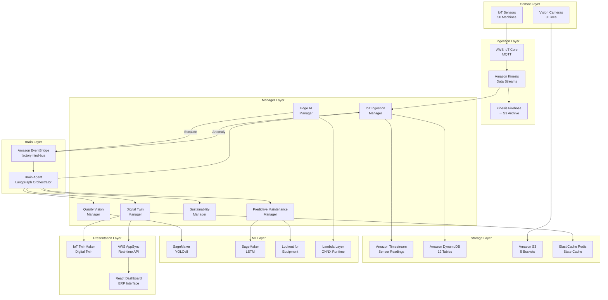
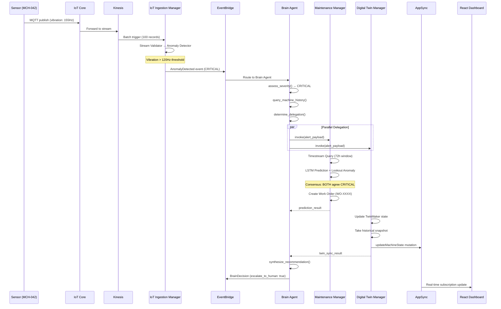
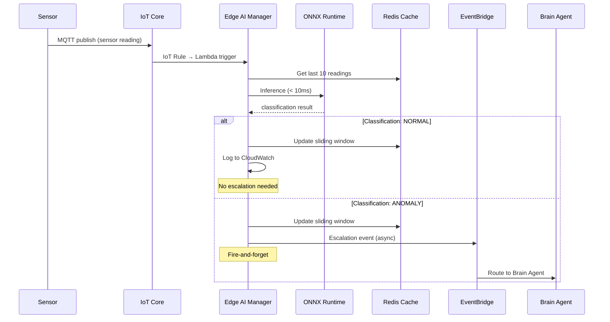
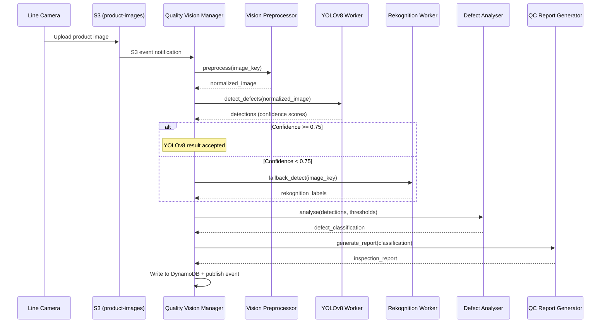

# Design Document: FactoryMind Multi-Agent Manufacturing Intelligence Platform

## Overview

FactoryMind is a hierarchical multi-agent manufacturing intelligence system built on AWS Bedrock AgentCore. The platform employs a Brain Agent (LangGraph orchestrator) as the top-level decision maker that delegates to 6 Manager Agents, each managing their own specialized Worker Agents. The system processes real-time sensor data from 50 machines across 3 production lines at the Chennai Plant (PLANT-001), providing predictive maintenance, quality inspection, sustainability monitoring, and digital twin synchronization.

The architecture follows a strict delegation hierarchy: Brain Agent → Manager Agents → Worker Agents. Edge AI operates independently for sub-10ms inference decisions, escalating to the cloud path only when anomalies are detected. All inter-agent communication flows through Amazon EventBridge, with DynamoDB as the state store and Timestream for time-series sensor data.

The platform targets manufacturing environments requiring real-time decision-making with SLAs ranging from <10ms (edge inference) to <5s (sustainability analysis), supporting 600 sensor events per minute (50 machines × 12 readings/minute).

## Architecture

### System-Level Architecture



### Agent Hierarchy Detail

```mermaid
graph TD
    BRAIN[Brain Agent<br/>LangGraph Orchestrator<br/>SLA: &lt;2s]

    subgraph "IoT Ingestion Manager"
        IOT_M[Manager<br/>SLA: &lt;500ms]
        IOT_W1[Stream Validator]
        IOT_W2[Anomaly Detector]
        IOT_W3[Data Router]
        IOT_M --> IOT_W1
        IOT_M --> IOT_W2
        IOT_M --> IOT_W3
    end

    subgraph "Quality Vision Manager"
        QV_M[Manager<br/>SLA: &lt;3s]
        QV_W1[Vision Preprocessor]
        QV_W2[YOLOv8 Worker]
        QV_W3[Rekognition Worker]
        QV_W4[Defect Analyser]
        QV_W5[QC Report Generator]
        QV_M --> QV_W1
        QV_M --> QV_W2
        QV_M --> QV_W3
        QV_M --> QV_W4
        QV_M --> QV_W5
    end

    subgraph "Predictive Maintenance Manager"
        PM_M[Manager<br/>SLA: &lt;3s]
        PM_W1[Timestream Query]
        PM_W2[LSTM Prediction]
        PM_W3[Lookout Anomaly]
        PM_W4[Maintenance Scheduler]
        PM_W5[Work Order Creator]
        PM_M --> PM_W1
        PM_M --> PM_W2
        PM_M --> PM_W3
        PM_M --> PM_W4
        PM_M --> PM_W5
    end

    subgraph "Sustainability Manager"
        SUS_M[Manager<br/>SLA: &lt;5s]
        SUS_W1[Energy Monitor]
        SUS_W2[KPI Calculator]
        SUS_W3[Waste Detector]
        SUS_W4[Carbon Calculator]
        SUS_W5[GenAI Recommender]
        SUS_M --> SUS_W1
        SUS_M --> SUS_W2
        SUS_M --> SUS_W3
        SUS_M --> SUS_W4
        SUS_M --> SUS_W5
    end

    subgraph "Digital Twin Manager"
        DT_M[Manager<br/>SLA: &lt;500ms]
        DT_W1[TwinMaker Sync]
        DT_W2[Dashboard Publisher]
        DT_W3[State Reconciler]
        DT_W4[Historical Snapshot]
        DT_M --> DT_W1
        DT_M --> DT_W2
        DT_M --> DT_W3
        DT_M --> DT_W4
    end

    subgraph "Edge AI Manager"
        EDGE_M[Manager<br/>SLA: &lt;10ms]
        EDGE_W1[ONNX Inference]
        EDGE_W2[Edge Classifier]
        EDGE_W3[Cloud Escalation]
        EDGE_W4[Edge Cache]
        EDGE_M --> EDGE_W1
        EDGE_M --> EDGE_W2
        EDGE_M --> EDGE_W3
        EDGE_M --> EDGE_W4
    end

    BRAIN --> IOT_M
    BRAIN --> QV_M
    BRAIN --> PM_M
    BRAIN --> SUS_M
    BRAIN --> DT_M
```



## Sequence Diagrams

### Critical Alert Flow (Brain Agent Full Delegation)



### Edge AI Fire-and-Forget Path



### Quality Vision Inspection Pipeline



## Components and Interfaces

### Component 1: Brain Agent (LangGraph Orchestrator)

**Purpose**: Top-level decision maker that assesses alert severity, queries machine history, determines which managers to activate, delegates work, and synthesizes unified recommendations.

**Interface**:
```python
from typing import TypedDict, Literal
from pydantic import BaseModel


class AlertSummary(BaseModel):
    """Incoming alert from IoT Ingestion or Edge AI."""
    machine_id: str          # MCH-001 through MCH-050
    alert_type: str          # VIBRATION_ANOMALY, TEMPERATURE_SPIKE, DEFECT_DETECTED, ENERGY_SPIKE
    severity: str            # CRITICAL, HIGH, MEDIUM, LOW
    timestamp: str           # ISO 8601
    raw_sensor_snapshot: dict  # Current sensor values
    production_line: str     # LINE-A, LINE-B, LINE-C


class BrainInput(BaseModel):
    """Input event to Brain Agent Lambda."""
    plant_id: str            # PLANT-001
    alert_summary: AlertSummary
    source: str              # "iot_ingestion" | "edge_ai" | "scheduled"


class BrainOutput(BaseModel):
    """Output from Brain Agent."""
    brain_decision_id: str   # BRN-<uuid>
    plant_id: str
    machine_id: str
    severity_assessed: str
    agents_activated: list[str]
    delegation_results: dict
    unified_recommendation: str
    escalate_to_human: bool
    eventbridge_event_published: bool
    processing_time_ms: int


class BrainState(TypedDict):
    """LangGraph state passed between graph nodes."""
    alert_input: dict
    machine_history: dict | None
    severity_assessed: str
    agents_to_activate: list[str]
    delegation_results: dict
    unified_recommendation: str
    escalate_to_human: bool
    brain_decision_id: str
```

**Responsibilities**:
- Assess and potentially override alert severity based on raw sensor values
- Query machine history from DynamoDB for context
- Route alerts to appropriate managers based on severity and alert type
- Invoke managers in parallel where possible
- Synthesize results into unified recommendation
- Publish decisions to EventBridge
- Escalate to human operators for CRITICAL events

### Component 2: IoT Ingestion Manager

**Purpose**: Processes real-time sensor data batches from Kinesis, validates readings, detects anomalies, and routes data to appropriate storage.

**Interface**:
```python
from pydantic import BaseModel, field_validator
from datetime import datetime


class SensorReading(BaseModel):
    """Single sensor reading from MQTT."""
    machine_id: str
    timestamp: str
    temperature_c: float
    vibration_hz: float
    pressure_bar: float
    rpm: float
    power_kw: float
    production_line: str

    @field_validator("timestamp")
    @classmethod
    def validate_not_stale(cls, v: str) -> str:
        ts = datetime.fromisoformat(v)
        if (datetime.utcnow() - ts).total_seconds() > 60:
            raise ValueError("Stale reading: older than 60 seconds")
        return v


class IngestionBatchInput(BaseModel):
    """Kinesis batch event."""
    plant_id: str
    records: list[SensorReading]  # Up to 100 per batch


class AnomalyEvent(BaseModel):
    """Published to EventBridge when anomaly detected."""
    ingestion_id: str        # ING-<uuid>
    machine_id: str
    alert_type: str
    severity: str
    anomaly_score: float     # 0.0 to 1.0
    raw_sensor_snapshot: dict
    timestamp: str


class IngestionOutput(BaseModel):
    """Output from IoT Ingestion Manager."""
    ingestion_id: str
    records_processed: int
    records_rejected: int
    anomalies_detected: int
    anomaly_events: list[AnomalyEvent]
    processing_time_ms: int
```

**Responsibilities**:
- Validate sensor readings (reject stale timestamps > 60s)
- Detect anomalies using threshold-based rules
- Write validated data to Timestream (SensorReadings table)
- Update machine state in DynamoDB (FactoryMind_MachineState)
- Publish anomaly events to EventBridge for Brain Agent

### Component 3: Quality Vision Manager

**Purpose**: Orchestrates the visual inspection pipeline using YOLOv8 as primary detector with Rekognition fallback, classifies defects, and generates QC reports.

**Interface**:
```python
from pydantic import BaseModel
from enum import Enum


class DefectType(str, Enum):
    SCRATCH = "SCRATCH"
    DENT = "DENT"
    CRACK = "CRACK"
    DISCOLORATION = "DISCOLORATION"
    MISALIGNMENT = "MISALIGNMENT"
    NO_DEFECT = "NO_DEFECT"


class BoundingBox(BaseModel):
    x: float
    y: float
    width: float
    height: float


class Detection(BaseModel):
    defect_type: DefectType
    confidence: float        # 0.0 to 1.0
    bounding_box: BoundingBox


class QualityInspectionInput(BaseModel):
    """Input to Quality Vision Manager."""
    plant_id: str
    machine_id: str
    production_line: str
    image_s3_key: str        # Key in factorymind-product-images bucket
    product_type: str
    batch_number: str


class QualityInspectionOutput(BaseModel):
    """Output from Quality Vision Manager."""
    inspection_report_id: str  # QCR-<uuid>
    plant_id: str
    machine_id: str
    verdict: str             # PASS, FAIL, REVIEW
    defects_found: list[Detection]
    primary_model: str       # "yolov8" | "rekognition"
    confidence_score: float
    defect_rate: float       # Current batch defect rate
    threshold_exceeded: bool
    processing_time_ms: int
```

**Responsibilities**:
- Preprocess images (resize, normalize) for model input
- Run YOLOv8 inference via SageMaker endpoint
- Fallback to Rekognition if YOLOv8 confidence < 0.75
- Classify defects and determine pass/fail verdict
- Generate inspection reports with annotated images
- Track defect rates against thresholds per product type

### Component 4: Predictive Maintenance Manager

**Purpose**: Predicts machine failures using LSTM time-series analysis and Lookout for Equipment anomaly detection, with consensus-based CRITICAL classification.

**Interface**:
```python
from pydantic import BaseModel
from datetime import datetime


class MaintenancePrediction(BaseModel):
    """Single failure prediction."""
    failure_mode: str        # BEARING_WEAR, MOTOR_OVERHEAT, BELT_SLIP, etc.
    probability: float       # 0.0 to 1.0
    estimated_rul_hours: float  # Remaining Useful Life
    confidence_interval: tuple[float, float]


class PredictiveMaintenanceInput(BaseModel):
    """Input to Predictive Maintenance Manager."""
    plant_id: str
    machine_id: str
    alert_type: str
    raw_sensor_snapshot: dict
    timestamp: str


class WorkOrder(BaseModel):
    """Generated work order for maintenance."""
    work_order_id: str       # WO-<sequential>
    machine_id: str
    priority: str            # CRITICAL, HIGH, MEDIUM, LOW
    failure_mode: str
    recommended_action: str
    estimated_downtime_hours: float
    parts_required: list[str]
    scheduled_date: str


class PredictiveMaintenanceOutput(BaseModel):
    """Output from Predictive Maintenance Manager."""
    prediction_report_id: str  # PRD-<uuid>
    plant_id: str
    machine_id: str
    lstm_prediction: MaintenancePrediction
    lookout_prediction: MaintenancePrediction
    consensus_reached: bool
    final_severity: str
    work_order: WorkOrder | None
    processing_time_ms: int
```

**Responsibilities**:
- Query 72-hour rolling sensor window from Timestream
- Run LSTM prediction via SageMaker endpoint
- Run Lookout for Equipment anomaly detection
- Apply consensus rule: BOTH must agree for CRITICAL
- Generate work orders for HIGH/CRITICAL predictions
- Queue work orders to SQS for downstream processing
- Publish prediction events to EventBridge

### Component 5: Sustainability Manager

**Purpose**: Monitors energy consumption, calculates sustainability KPIs, detects waste patterns, computes carbon footprint, and generates AI-powered optimization recommendations.

**Interface**:
```python
from pydantic import BaseModel


class EnergyMetrics(BaseModel):
    """Energy consumption metrics for a machine."""
    machine_id: str
    current_kwh: float
    baseline_kwh: float
    deviation_pct: float
    cost_inr: float          # Rs 7.50 per kWh


class SustainabilityKPI(BaseModel):
    """Daily sustainability KPI."""
    energy_efficiency: float  # 0.0 to 1.0
    carbon_footprint_kg: float  # 0.82 kg CO2/kWh
    waste_index: float       # 0.0 to 1.0
    overall_score: float     # Composite 0-100


class SustainabilityInput(BaseModel):
    """Input to Sustainability Manager."""
    plant_id: str
    machine_id: str | None   # None for plant-wide analysis
    analysis_type: str       # "real_time" | "daily_report" | "weekly_report"
    timestamp: str


class SustainabilityOutput(BaseModel):
    """Output from Sustainability Manager."""
    report_id: str           # SUSR-<uuid>
    plant_id: str
    energy_metrics: list[EnergyMetrics]
    kpis: SustainabilityKPI
    recommendations: list[str]
    carbon_saved_kg: float
    cost_saved_inr: float
    processing_time_ms: int
```

**Responsibilities**:
- Monitor real-time energy consumption from Timestream
- Calculate KPIs against baselines stored in DynamoDB
- Detect waste patterns (idle machines consuming power)
- Compute carbon footprint (0.82 kg CO2/kWh India grid)
- Generate AI recommendations via Bedrock Claude 3.5
- Email weekly reports via SES
- Publish sustainability events to EventBridge

### Component 6: Digital Twin Manager

**Purpose**: Maintains the real-time digital representation of the plant, synchronizes state across TwinMaker, Redis cache, and AppSync for dashboard consumption.

**Interface**:
```python
from pydantic import BaseModel
from typing import Any


class MachineState(BaseModel):
    """Current state of a machine in the digital twin."""
    machine_id: str
    machine_type: str        # CNC_LATHE, HYDRAULIC_PRESS, etc.
    production_line: str
    status: str              # RUNNING, IDLE, MAINTENANCE, FAULT
    health_score: float      # 0.0 to 1.0
    last_sensor_reading: dict
    last_updated: str
    active_alerts: list[str]


class TwinSyncInput(BaseModel):
    """Input to Digital Twin Manager."""
    plant_id: str
    machine_id: str
    state_update: dict
    source: str              # "iot_ingestion" | "brain_decision" | "maintenance"
    severity: str | None


class TwinSyncOutput(BaseModel):
    """Output from Digital Twin Manager."""
    sync_id: str             # TWNR-<uuid>
    plant_id: str
    machine_id: str
    twinmaker_updated: bool
    redis_updated: bool
    appsync_published: bool
    snapshot_taken: bool     # True for CRITICAL events
    processing_time_ms: int
```

**Responsibilities**:
- Update Redis cache (TTL 300s) for fast reads
- Persist state to DynamoDB (FactoryMind_TwinState)
- Sync to IoT TwinMaker workspace
- Publish state changes via AppSync mutations
- Take historical snapshots to S3 on CRITICAL events
- Reconcile state if cache and DynamoDB diverge

### Component 7: Edge AI Manager

**Purpose**: Provides sub-10ms inference at the edge using ONNX Runtime, classifies sensor readings locally, and escalates anomalies to the cloud asynchronously.

**Interface**:
```python
from pydantic import BaseModel
from enum import Enum


class EdgeClassification(str, Enum):
    NORMAL = "NORMAL"
    WARNING = "WARNING"
    ANOMALY = "ANOMALY"


class EdgeInferenceInput(BaseModel):
    """Input from IoT Core rule."""
    machine_id: str
    timestamp: str
    sensor_values: dict      # Raw sensor readings
    plant_id: str


class EdgeInferenceOutput(BaseModel):
    """Output from Edge AI Manager."""
    edge_result_id: str      # EDGR-<uuid>
    machine_id: str
    classification: EdgeClassification
    confidence: float
    inference_time_ms: float  # Must be < 10ms
    escalated: bool
    processing_time_ms: int
```

**Responsibilities**:
- Load ONNX model from Lambda Layer
- Maintain sliding window of last 10 readings in Redis
- Run inference in < 10ms
- Classify as NORMAL, WARNING, or ANOMALY
- Escalate ANOMALY to EventBridge (fire-and-forget)
- Never retry, never wait for cloud response
- Log all decisions to CloudWatch

## Data Models

### Model 1: Machine State (DynamoDB)

```python
from pydantic import BaseModel
from typing import Optional


class MachineStateRecord(BaseModel):
    """DynamoDB: FactoryMind_MachineState (PK: machine_id)"""
    machine_id: str                    # MCH-001 through MCH-050
    plant_id: str                      # PLANT-001
    machine_type: str                  # CNC_LATHE | HYDRAULIC_PRESS | CONVEYOR | ROBOT_ARM | WELDING_UNIT
    production_line: str               # LINE-A | LINE-B | LINE-C
    status: str                        # RUNNING | IDLE | MAINTENANCE | FAULT
    health_score: float                # 0.0 to 1.0
    last_temperature_c: float
    last_vibration_hz: float
    last_pressure_bar: float
    last_rpm: float
    last_power_kw: float
    last_reading_timestamp: str        # ISO 8601
    active_alerts: list[str]           # List of alert IDs
    maintenance_due_date: Optional[str]
    total_runtime_hours: float
    updated_at: str                    # ISO 8601
```

**Validation Rules**:
- `machine_id` must match pattern `MCH-\d{3}`
- `health_score` must be between 0.0 and 1.0
- `last_reading_timestamp` must not be stale (> 60s for active machines)
- `status` transitions: RUNNING ↔ IDLE, any → MAINTENANCE, any → FAULT

### Model 2: Sensor Reading (Timestream)

```python
class TimestreamSensorReading(BaseModel):
    """Timestream: FactoryMindSensors.SensorReadings"""
    # Dimensions
    machine_id: str
    plant_id: str
    production_line: str
    sensor_type: str                   # temperature | vibration | pressure | rpm | power

    # Measures
    value: float
    unit: str                          # celsius | hz | bar | rpm | kw

    # Time
    timestamp: str                     # Nanosecond precision ISO 8601
```

**Validation Rules**:
- Temperature: 0°C to 200°C (reject outliers)
- Vibration: 0 Hz to 500 Hz
- Pressure: 0 bar to 50 bar
- RPM: 0 to 10000
- Power: 0 kW to 100 kW

### Model 3: Work Order (DynamoDB)

```python
class WorkOrderRecord(BaseModel):
    """DynamoDB: FactoryMind_WorkOrders (PK: work_order_id)"""
    work_order_id: str                 # WO-<sequential>
    machine_id: str
    plant_id: str
    priority: str                      # CRITICAL | HIGH | MEDIUM | LOW
    status: str                        # OPEN | IN_PROGRESS | COMPLETED | CANCELLED
    failure_mode: str
    predicted_by: str                  # "lstm" | "lookout" | "consensus"
    probability: float
    recommended_action: str
    estimated_downtime_hours: float
    parts_required: list[str]
    scheduled_date: str
    assigned_to: Optional[str]
    created_at: str
    completed_at: Optional[str]
    prediction_report_id: str          # PRD-<uuid> reference
```

**Validation Rules**:
- `priority` CRITICAL requires `predicted_by` = "consensus"
- `estimated_downtime_hours` must be positive
- `scheduled_date` must be in the future for OPEN orders
- Status transitions: OPEN → IN_PROGRESS → COMPLETED, OPEN → CANCELLED

### Model 4: Quality Inspection Result (DynamoDB)

```python
class QualityResultRecord(BaseModel):
    """DynamoDB: FactoryMind_QualityResults (PK: inspection_report_id)"""
    inspection_report_id: str          # QCR-<uuid>
    plant_id: str
    machine_id: str
    production_line: str
    product_type: str
    batch_number: str
    image_s3_key: str
    verdict: str                       # PASS | FAIL | REVIEW
    defects: list[dict]                # List of Detection objects
    primary_model: str                 # "yolov8" | "rekognition"
    confidence_score: float
    defect_rate: float
    threshold_exceeded: bool
    annotated_image_s3_key: Optional[str]
    inspected_at: str
    processing_time_ms: int
```

### Model 5: Edge Inference Result (DynamoDB)

```python
class EdgeResultRecord(BaseModel):
    """DynamoDB: FactoryMind_EdgeResults (PK: edge_result_id)"""
    edge_result_id: str                # EDGR-<uuid>
    machine_id: str
    plant_id: str
    classification: str                # NORMAL | WARNING | ANOMALY
    confidence: float
    inference_time_ms: float
    sensor_values: dict
    sliding_window_size: int           # Should be 10
    escalated: bool
    escalation_event_id: Optional[str]
    timestamp: str
```

